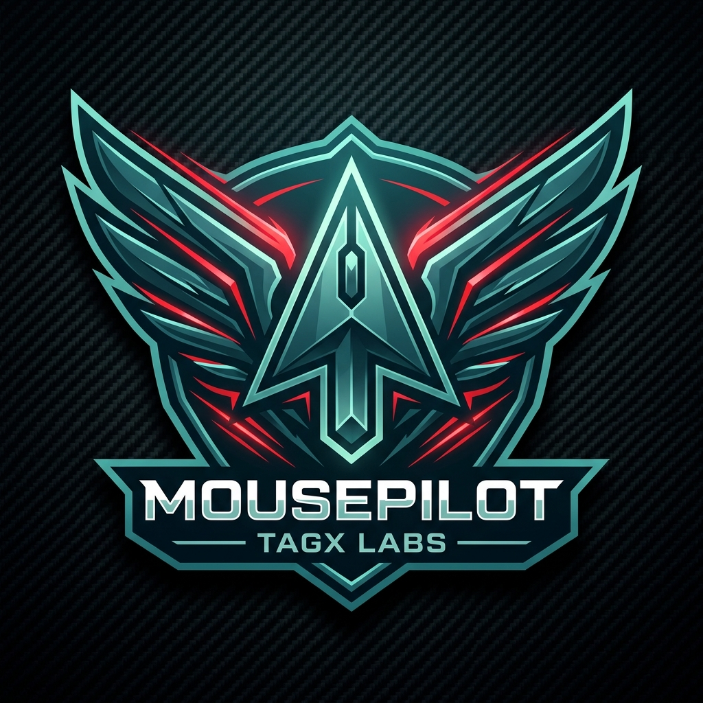

# 🖱️ MousePilot — Official Product Website

<div align="center">



### **Put your cursor on autopilot.**
*The official high-performance web experience for **MousePilot** by **TAGX Labs™***

[](https://tagx-lab.github.io/mousepilot-website/)
[](https://microsoft.com)
[](https://tagx-lab.github.io/mousepilot-website/)
[](LICENSE)

</div>

---

## 🌐 Live Product Experience

The website is deployed and hosted live on GitHub Pages:  
👉 **[https://tagx-lab.github.io/mousepilot-website/](https://tagx-lab.github.io/mousepilot-website/)**

---

## 🌟 About MousePilot

**MousePilot** (by **TAGX Labs™**) is an enterprise-grade autonomous cursor keep-alive & anti-sleep desktop utility for Windows 10 & 11. It prevents idle lockouts, system sleep, and absent status indicators while guaranteeing **100% zero synthetic clicks or keypresses** — utilizing pure coordinate kinematics and instant human-takeover yield detection.

---

## ✨ Website Architecture & Features

This repository contains the complete production static website for MousePilot:

1. **Floating Island Glass Navbar**:
   - Modern floating pill navbar with glassmorphism backdrop blur.
   - Dynamic ScrollSpy tracking for section indicators.
   - Mobile-responsive navigation drawer.

2. **Interactive Kinematics Simulator (`js/interactive.js`)**:
   - Live canvas preview simulating the 4 core movement patterns:
     - 🌀 **Gentle Orbit** (smooth circular trajectory)
     - 🥷 **Stealth 1-Pixel** (micro-jiggle undetectable to observers)
     - ♾️ **Figure-8** (infinity loop path)
     - 🎲 **Random Wander** (Brownian drift with smooth interpolation)
   - Real-time radius and speed sliders with live coordinate readouts.

3. **3D WebGL Ambient Effects (`js/three-scene.js`)**:
   - Hardware-accelerated particle atmosphere and glowing geometric accents.
   - Non-blocking render loop with responsive viewport resizing.

4. **Product Download Center**:
   - Direct download packages served with SHA-256 integrity checksums:
     - **MousePilot Setup (.exe)** — Full Windows Inno Setup installer.
     - **MousePilot Portable (.zip)** — Zero-install standalone executable.
   - Operating system and security verification specifications.

5. **Design System & Typography**:
   - Custom bespoke editorial palette:
     - `Void Black (#030706)`
     - `Surface Dark (#0a171d)`
     - `Brand Aqua (#8CC7C4)`
     - `Brand Cyan (#00FFEA)`
     - `Brand Crimson (#DB1A1A)`
     - `Brand Petrol (#2C687B)`
   - Modern typography pairing: **Plus Jakarta Sans**, **Space Grotesk**, and **JetBrains Mono**.

---

## 📁 Repository Structure

```
mousepilot-website/
├── index.html                   # Core semantic landing page & sections
├── assets/
│   ├── icon.ico                 # High-resolution application icon
│   ├── icon.png                 # App icon artwork (PNG)
│   └── logo.png                 # Official MousePilot / TAGX Labs emblem
├── css/
│   ├── design-system.css        # Spatial tokens, colors, CSS variables
│   ├── components.css           # Glass cards, buttons, badges, modals
│   └── animations.css           # Micro-interactions, keyframes & glows
├── js/
│   ├── animations.js            # Scroll reveals & intersection observers
│   ├── interactive.js           # Kinematic canvas simulator & UI logic
│   └── three-scene.js           # 3D WebGL background effects
├── downloads/
│   ├── MousePilot-Setup-v1.0.0.exe      # Windows Installer package
│   ├── MousePilot-v1.0.0-Portable.zip   # Portable standalone ZIP
│   └── checksums.txt                    # SHA-256 verification hashes
├── .gitignore                   # Standard OS & editor exclusions
└── README.md                    # Project documentation
```

---

## ⚡ Local Development

No package manager or build pipeline required — pure modern web standards:

1. Clone the repository:
   ```bash
   git clone https://github.com/TagX-Lab/mousepilot-website.git
   cd mousepilot-website
   ```

2. Open `index.html` in your browser:
   - Double click `index.html` or use VS Code Live Server / Python HTTP server:
   ```bash
   python -m http.server 8000
   ```
   - Navigate to `http://localhost:8000`

---

## 🛡️ Security & Cyber Defense (Zero-Trust Architecture)

MousePilot and this website are hardened against tampering, malicious injection, and unauthorized framing:

- **Strict Content Security Policy (CSP)** & Anti-MIME Sniffing (`nosniff`).
- **Anti-Clickjacking Protection**: `X-Frame-Options: DENY`, `frame-ancestors: 'none'`, and active client-side JavaScript Framebuster.
- **Client-Side SHA-256 WebCrypto Verifier**: Visitors can drag-and-drop downloaded files to verify authenticity in-memory with zero server upload.
- **Automated Security Pipelines**: GitHub CodeQL semantic scanning and binary checksum verification on every push.
- **RFC 9116 Compliant**: Standard `/.well-known/security.txt` and responsible disclosure process.

Read our complete policy: **[SECURITY.md](SECURITY.md)**.

---

## 📜 License

Created & maintained by **[TAGX Labs™](https://github.com/TagX-Lab)**. Distributed under the **MIT License**.
